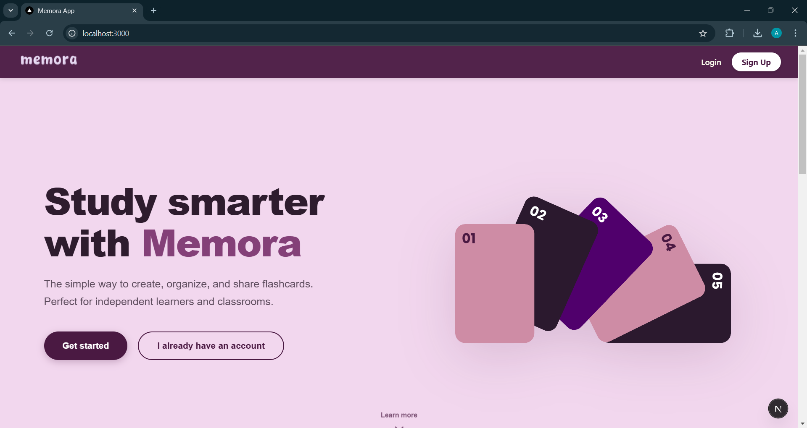

# Memora

**Memora** is a lightweight, cross-device flashcard application designed to help students learn better and teachers manage classroom study materials efficiently. It focuses on simplicity, privacy, and organized learning through manual flashcard creation and classroom integration.

---

## 🚀 Features

### For Students
* **Manual Creation:** Build custom flashcards with terms and definitions.
* **Study Modes:**
  * **Flashcards:** Traditional flip-card style study.
  * **Quiz:** Test your knowledge.
  * **Multiple Choice:** Fast-paced recognition practice.
* **Organization:** Group decks into folders and access recently used sets quickly.
* **Classroom Integration:** Join classes using a unique code provided by your teacher to access assigned materials automatically.

### For Teachers
* **Class Management:** Create classes and generate unique access codes.
* **Curriculum Control:** Create decks and assign them directly to specific classes.
* **Student Tracking:** View the list of students enrolled in your classes.
* **Library:** Manage personal and class-specific decks in a unified library.

---

## 🛠️ Tech Stack

**Frontend:**
* **Framework:** [Next.js](https://nextjs.org/) (React)
* **Language:** TypeScript
* **Styling:** CSS Modules
* **Icons:** Lucide React
* **Animations:** Framer Motion

**Backend:**
* **Framework:** ASP.NET Core Web API
* **Language:** C#
* **Database:** Google Cloud Firestore (NoSQL)
* **Authentication:** Firebase Authentication

---

## 📋 Prerequisites

Before running the project, ensure you have the following installed:
* [Node.js](https://nodejs.org/) (v18 or higher)
* [.NET SDK](https://dotnet.microsoft.com/download) (v8.0 or compatible)
* A Firebase Project with **Authentication** and **Firestore** enabled.

---
